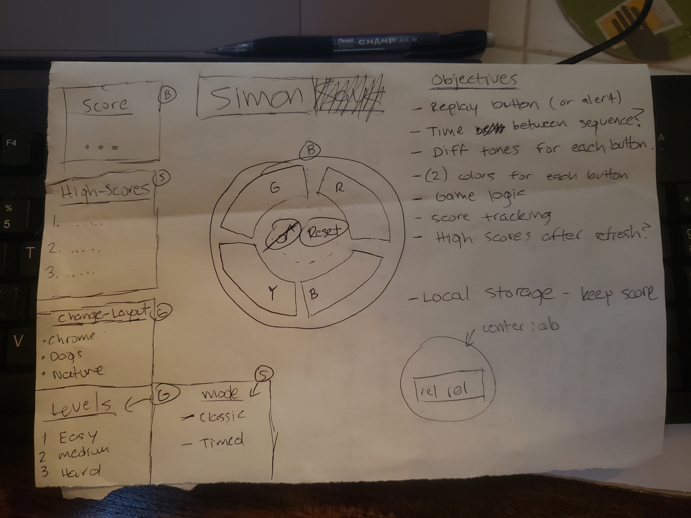
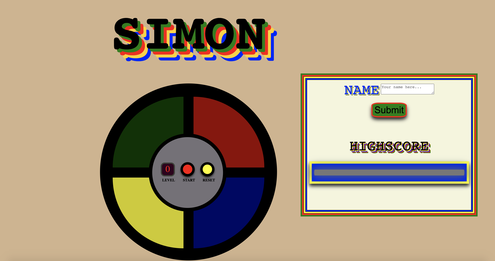

# ZacBenckendorf - Simon

# Wireframe 

# List of Features
- Press the START button. Simon will give the first signal. Repeat the signal by pressing the same color lens.
- Simon will duplicate the first signal and add one. Repeat these two signals by pressing the same color lenses, in order.
- Simon will duplicate these first two signals and add one.
- Continue playing as long as you can repeat each sequence of signals correctly.
- If you fail to repeat a sequence exactly, you fail and the game will alert you. This means you've lost, and the sequence of signals ends.
- Record name in the name text field on right side of screen, and if this is the high score it will populate with given score.

# Technologies Used:
- **Command Line:** used for working in the code through the browser. Also, useful tool for checking the location of errors.
- **Terminal:** used to track local changes of Git repo and upload chnages on code to Git repo.
- **Visual Studio code:** used for coding with Html5, CSS6, and JavaScript.
- **Google Chrome:** Browser used to launch website.
- **Codepen.io:** used for css design.

# Installation:
**What you will need:**
- **Web Browser**
- **Internet**
- **Javascript support**
- **Command Line:** Need practicee navigating file system.
- **Github**
- **Web/Browser fundamentals:** Ability to communicate with browser and understand functionality.
- **Deployment:** Host a static web site in a managed hosting environment.

# Solved/Unsolved Problems:
- **Create Game Board(Bronze)** Game Board is functional and allows User the ability to play the game (yes)
- **Track Score(Bronze)** User is able to visully see their score(level) (yes)
- **Track Highscore(Silver)** User is able to track highscore locally to browser (yes)
  - Adding API to JS would allow highscore that is not stored only to local browser
- **Incorporate Levels(Gold)** Have different levels with varrying speed (no)
- **Change Layout(Gold)** Allow user to change css layout of board (no)

# Game Access

[Game Link](https://condescending-carson-085219.netlify.app/)

